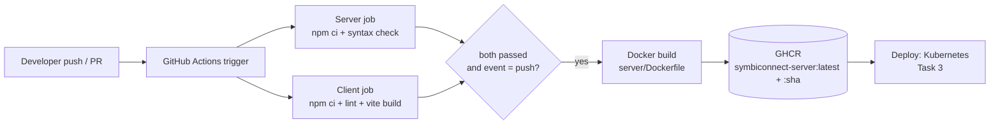

# Pipeline diagram

```mermaid
flowchart LR
  A[Developer push / PR] --> B[GitHub Actions trigger]
  B --> C[Server job<br/>npm ci + syntax check]
  B --> D[Client job<br/>npm ci + lint + vite build]
  C --> E{both passed<br/>and event = push?}
  D --> E
  E -- yes --> F[Docker build<br/>server/Dockerfile]
  F --> G[(GHCR<br/>symbiconnect-server:latest + :sha)]
  G --> H[Deploy: Kubernetes<br/>Task 3]
```
